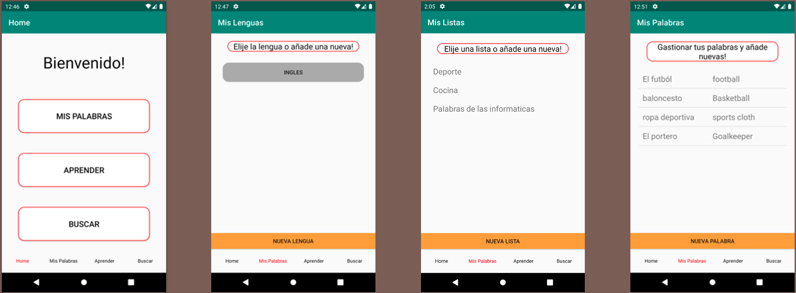
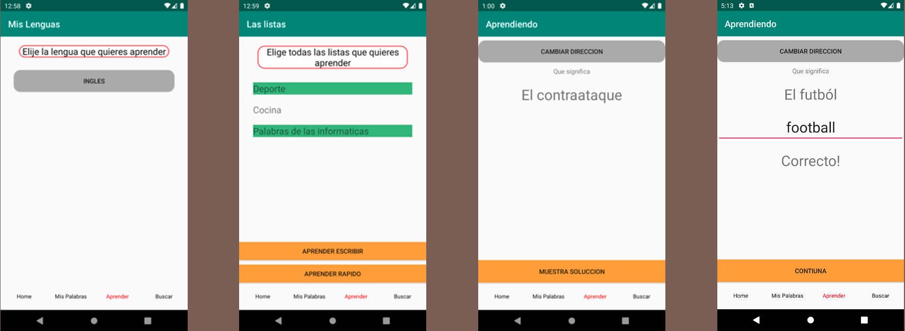
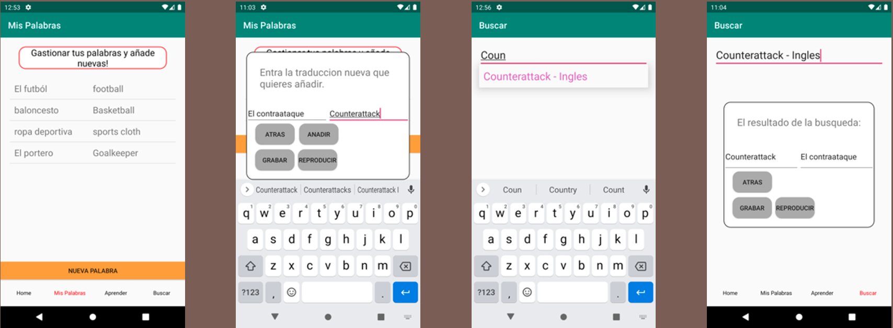

# Vocabulary Learning App

Learning a new language is a challenging task, and while there are many apps designed to help with this process, they often come with their own set of problems:
- They are full of ads
- Very limited free functionalities
- They don’t let you manage your own words

## Our Solution

The Vocabulary Learning App is designed to address these issues by offering a customizable and user-friendly platform that puts you in control of your language learning journey. Here's what our app offers:

- **Add and Edit Your Own Words**: Personalize your learning experience by adding and editing the vocabulary that you want to learn.
- **Organize Words in Categories**: Create categories to organize your vocabulary, making it easier to focus on specific areas of interest.
- **Record Audio for Pronunciation**: Use your microphone to record audio, allowing you to always have the correct pronunciation available. Ask a native speaker to pronounce the words for you and record it.
- **Two Ways of Learning Vocabulary**: Our app lets you study the vocabulary in both directions
- **Look Up Your Saved Words**: Easily search and review your saved vocabulary to reinforce your learning.

## Usage

### Adding Vocabulary

Navigate to the "Add Vocabulary" section of the app to enter new words and their meanings. You can also edit existing words to refine your vocabulary list.

### Organizing Words

Create and manage categories to group your vocabulary in a way that makes sense to you. This flexibility helps you concentrate on specific topics or areas of interest.

### Recording Pronunciation

In the "Voice Memos" section, use your microphone to record the pronunciation of words. This feature ensures you can always listen to the correct pronunciation, which is especially useful if you have a native speaker help you.

### Learning Methods

Explore the two different ways our app offers for learning vocabulary. Whether you prefer flashcards or quizzes, we have tools to support your learning style.

### Searching Your Vocabulary

Use the search feature to quickly find and review words you have saved. This helps reinforce your memory and ensures you can always refer back to words you’ve learned.

## Contributing

Contributions are welcome! Please feel free to fork the repository, make changes, and submit a pull request.

## License

This project is licensed under the MIT License - see the LICENSE file for details.

Happy learning !